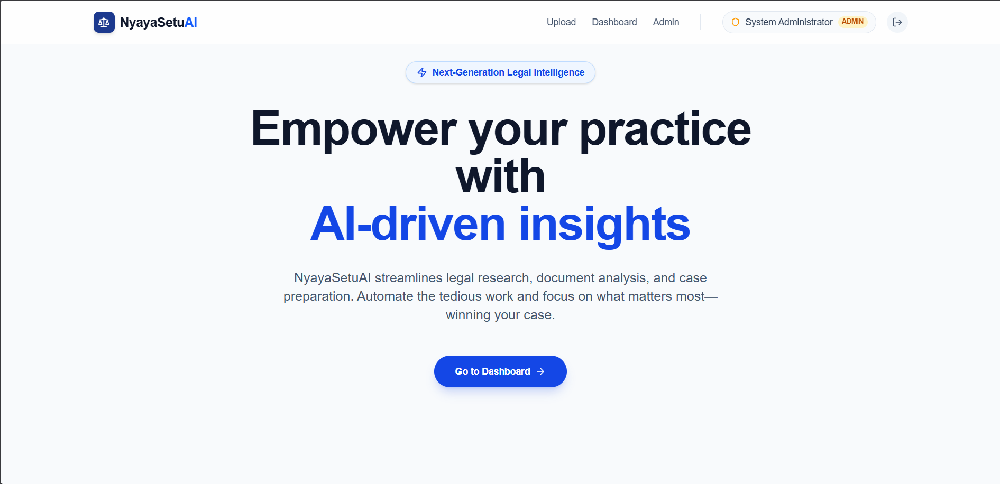
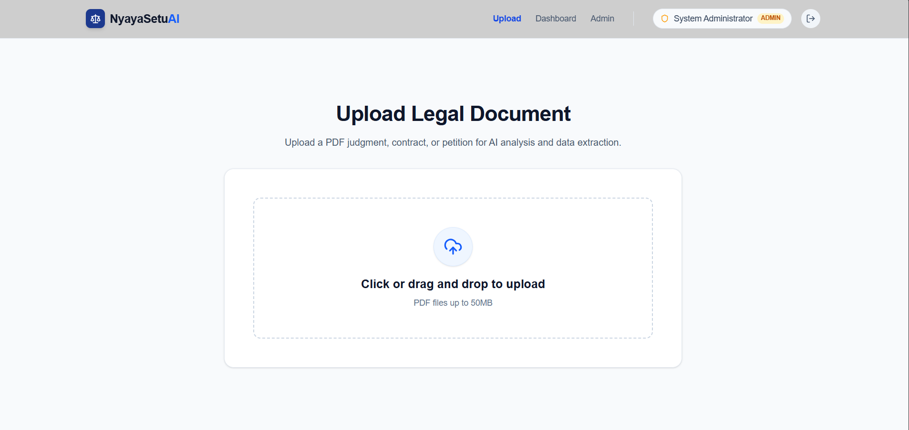
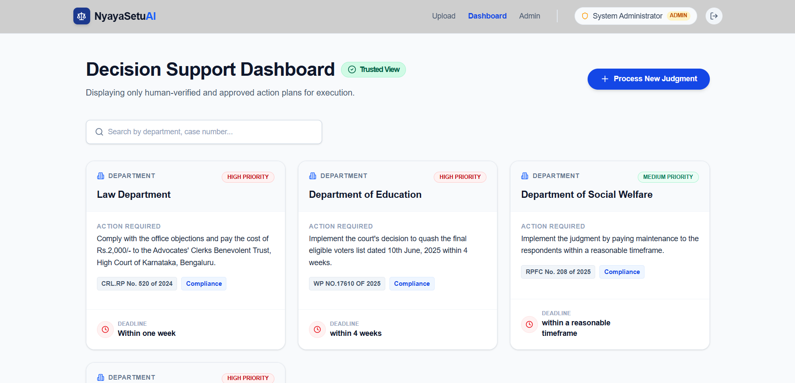
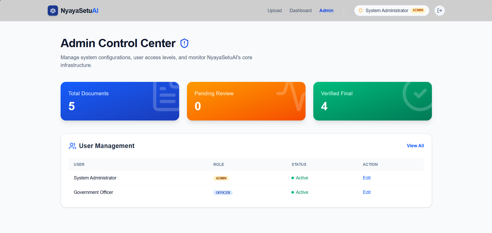

<div align="center">

# **NyayaSetuAI ⚖️🤖**

</div>

> AI-powered Legal Intelligence Platform that transforms unstructured court judgments into verified, actionable compliance and decision-support plans.


---

## 📌 Overview

Government departments and legal officers often struggle with:

- Lengthy court judgments (50–200 pages)
- Complex legal terminology
- Scanned and unstructured PDF files
- Hidden compliance directives and deadlines
- Slow and error-prone manual analysis

**NyayaSetuAI** solves this problem by converting legal judgments into:

✅ Structured case information  
✅ AI-generated compliance insights  
✅ Department-wise action plans  
✅ Deadline tracking and monitoring  
✅ Human-verified decision support workflows  

---

# ✨ Key Features

## 📄 Intelligent PDF Processing
- Upload scanned or digital court judgments
- OCR support using Tesseract
- Extract text from complex legal documents

## 🧠 AI-Powered Legal Intelligence
- Llama 3 powered legal analysis
- Semantic retrieval using Supabase pgvector
- Context-aware legal information extraction
- Action-plan generation from judgments

## ⚡ RAG Pipeline
- Document chunking
- Vector embeddings generation
- Semantic similarity search
- Contextual legal reasoning

## 👥 Human-in-the-Loop Verification
- Admin review workflow
- AI confidence scoring
- Human-approved outputs only
- Editable extraction verification

## 📊 Decision Support Dashboard
- Department-wise action plans
- Deadline tracking
- Compliance monitoring
- Appeal risk analysis

## 🔐 Enterprise Features
- JWT Authentication
- Role-based access control (RBAC)
- Admin and Officer dashboards
- Secure PDF storage

---

# 🏗️ System Architecture

```text
             ┌───────────────────┐
             │   External Users  │
             └─────────┬─────────┘
                       │
                       ▼
             ┌───────────────────┐
             │ Next.js Frontend  │
             └─────────┬─────────┘
                       │ REST API
                       ▼
             ┌───────────────────┐
             │ FastAPI Backend   │
             └─────────┬─────────┘
                       │
       ┌───────────────┼────────────────┐
       ▼               ▼                ▼
┌────────────┐ ┌──────────────┐ ┌─────────────┐
│ Llama 3 AI │ │ PostgreSQL   │ │ Supabase    │
│  (Groq)    │ │ + pgvector   │ │ Storage     │
└────────────┘ └──────────────┘ └─────────────┘
```

---

# 🔄 Processing Pipeline

```text
Upload PDF
     ↓
OCR + Text Extraction
     ↓
Chunking & Embeddings
     ↓
pgvector Semantic Retrieval
     ↓
Llama 3 Legal Analysis
     ↓
Action Plan Generation
     ↓
Human Verification
     ↓
Dashboard & Compliance Tracking
```

---

# 🧠 How the AI Works

### 1. PDF Upload
Users upload legal judgments or petitions.

### 2. OCR & Parsing
- PyMuPDF extracts text from digital PDFs
- Tesseract OCR handles scanned documents

### 3. Semantic Retrieval
- Text is chunked into smaller contexts
- Embeddings are generated using SentenceTransformers
- Stored inside Supabase pgvector
- Relevant legal context retrieved dynamically

### 4. LLM Processing
Llama 3 analyzes retrieved legal context to:
- Extract orders
- Identify authorities
- Detect deadlines
- Generate compliance actions
- Evaluate appeal risks

### 5. Human Verification
Admins verify AI-generated outputs before approval.

### 6. Dashboard Output
Verified action plans are displayed department-wise.

---

# 🛠️ Tech Stack

| Category | Technology |
|---|---|
| Frontend | Next.js (App Router), TypeScript, Tailwind CSS |
| Backend | FastAPI, Python |
| AI Model | Llama 3 (Groq API) |
| Vector Search | Supabase pgvector |
| Database | PostgreSQL |
| OCR | Tesseract OCR |
| PDF Processing | PyMuPDF |
| Authentication | JWT Authentication |
| Embeddings | SentenceTransformers |
| Storage | Supabase Storage |

---

## 🎯 Evaluation Criteria Mapping

| Criteria | Our Implementation |
|---|---|
| Accuracy of extraction | Hybrid LLM + rule-based regex, 11/12 court formats covered |
| Quality of action plan | Llama 3 + compliance/appeal classification with priority scoring |
| Human verification effectiveness | Mandatory Approve/Edit/Reject with confidence scores + source highlights |
| Dashboard clarity | Role-based access, department-wise view, deadline tracking |

---

## 🌐 Live Demo
**Frontend:** https://nyaya-setu-ai.vercel.app
**Demo credentials:**
- Admin: username=`admin` password=`admin123`
- Officer: username=`officer` password=`officer123`

**Sample judgment for testing:**
Download any Karnataka HC judgment from https://judgments.ecourts.gov.in

---


# 📂 Project Structure

```bash
NyayaSetuAI/
│
├── frontend/                 # Next.js frontend
│   ├── app/
│   ├── components/
│   ├── context/
│   └── public/
│
├── backend/                  # FastAPI backend
│   ├── routers/
│   ├── services/
│   ├── models/
│   ├── schemas/
│   ├── database/
│   └── utils/
│
├── README.md
└── docker-compose.yml
```

---

# ⚙️ Local Setup

## 📋 Prerequisites

- Node.js v18+
- Python 3.10+
- PostgreSQL
- Tesseract OCR
- Supabase Project
- Groq API Key

---

# 🚀 Backend Setup

```bash
cd backend

python -m venv venv
```

### Activate Virtual Environment

#### Windows
```bash
venv\Scripts\activate
```

#### Linux / macOS
```bash
source venv/bin/activate
```

### Install Dependencies

```bash
pip install -r requirements.txt
```

### Create `.env`

```env
GROQ_API_KEY=your_groq_key
SUPABASE_URL=your_supabase_url
SUPABASE_KEY=your_supabase_key
DATABASE_URL=your_database_url
JWT_SECRET_KEY=your_secret
JWT_ALGORITHM=HS256
JWT_EXPIRE_MINUTES=480
```

### Run Backend

```bash
uvicorn main:app --reload --port 8000
```

Backend runs on:

```text
http://localhost:8000
```

---

# 🌐 Frontend Setup

```bash
cd frontend
npm install --legacy-peer-deps
npm run dev
```

Frontend runs on:

```text
http://localhost:3000
```

---

# 🔐 Authentication & Roles

| Role | Permissions |
|---|---|
| Admin | Upload PDFs, verify AI outputs, manage users |
| Officer | View approved action plans and compliance data |

---

# 📈 Core Advantages

✅ Faster legal analysis  
✅ Reduced manual effort  
✅ Structured government workflows  
✅ AI-assisted compliance management  
✅ Human-verified accuracy  
✅ Scalable Legal AI architecture  

---

# ⚠️ Challenges

- Complex legal terminology
- OCR accuracy for low-quality scans
- Hallucination risks in LLM outputs
- Human verification dependency

---

# 🔮 Future Improvements

- Multilingual judgment analysis
- Real-time court integration APIs
- Fine-tuned legal LLMs
- Voice-based legal assistant
- AI-powered legal search engine
- Automated compliance notifications
- Analytics dashboard with insights

---

# 🧪 Sample Use Cases

## Government Departments
Track compliance requirements from High Court and Supreme Court judgments.

## Legal Officers
Quickly identify deadlines, directives, and responsible authorities.

## Administrative Bodies
Monitor implementation progress across departments.

## Judicial Analytics
Generate structured legal intelligence from unstructured judgments.

---

## 📸 Screenshots

### Frontend



### Upload Portal


### Decision Support Dashboard


### Admin Control Center


---

# 🤝 Contributors

Built with ❤️ for LegalTech innovation and AI-powered governance.

---

# 📜 License

This project is licensed under the MIT License.

---

# ⭐ Support

If you found this project useful:

- Star the repository ⭐
- Fork the project 🍴
- Contribute improvements 🚀

---

# 👨‍💻 Developed By

Team JusticeStack
